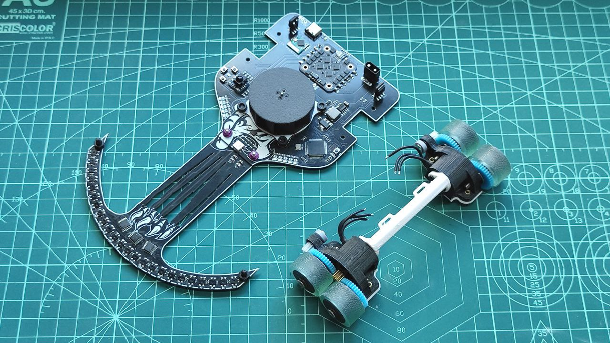

# FujitoraBot2

Versión 2 de FujitoraBot renovando el hardware después de 5 años: un pelín más
rápido, con 24 sensores de línea, giroscopio MPU-6500 y diseño más modular.

## 🏆 Palmarés

| Competición | Resultado | Fecha |
|------------|-----------|-------|
| — | — | — |

## ⚙️ Hardware

| Componente | Detalle |
|-----------|---------|
| **Microcontrolador** | STM32F405RGT6 @ 168 MHz, Cortex-M4F |
| **Sensores** | 24× IR de línea (multiplexados 3×8:1), MPU-6500 (giro ±2000 dps, SPI) |
| **Motores** | 2× DC brushless con ESC BLHeli (OneShot125) |
| **Encoders** | 2× magnéticos en cuadratura (TIM3/TIM4) |
| **Batería** | LiPo 2S/3S, detección automática, divisor ×3.8673 |
| **Ventilador** | Control PWM independiente con rampa de aceleración |
| **Chasis** | PCB propia (KiCad) + impresión 3D |
| **Peso** | — |

## 💻 Software

| Componente | Detalle |
|-----------|---------|
| **Framework** | LibOpenCM3 |
| **Entorno** | PlatformIO |
| **Lenguaje** | C11 |
| **Frecuencia control** | 1000 Hz (TIM5) |
| **Algoritmo** | PID en cascada (velocidad + ángulo + sensores de línea) |
| **Odometría** | Encoders + giroscopio, integración de posición X/Y/θ |
| **Debug** | USART3 @ 115200 + MacroArray (30k registros de telemetría) |

## 📚 Documentación

La documentación técnica completa está en [docs/](docs/):

- [Hardware](docs/01-hardware.md) — MCU, pinout, sensores, actuadores, chasis
- [Arquitectura Software](docs/02-software-architecture.md) — ISRs, DMA, prioridades, flujo
- [Sensores](docs/03-sensors.md) — 24 IR multiplexados, MPU-6500, filtros
- [Movimiento](docs/04-movement.md) — Motores BLHeli, OneShot125, ventilador
- [Control PID](docs/05-control-system.md) — PID cascada, ant-windup, arranque
- [Menú](docs/06-menu-system.md) — Navegación, perfiles, calibración/debug
- [Debug](docs/07-debug-system.md) — USART, macroarray, modos de diagnóstico
- [Calibración](docs/08-calibration.md) — Giroscopio Z, sensores IR, EEPROM
- [EEPROM](docs/09-storage.md) — Flash sector 11, layout de datos
- [Encoders y Giroscopio](docs/10-encoders-gyro.md) — Odometría, MPU-6500, fusión
- [Batería y LEDs](docs/11-battery-leds.md) — Medición, 2S/3S, indicadores
- [Cinemática](docs/12-kinematics.md) — 6 perfiles de velocidad predefinidos
- [Problemas Conocidos](docs/13-known-issues.md) — Issues y bugs documentados

## 🎥 Vídeos

<!-- Enlaces a vídeos del robot en acción -->

## 🔧 Stack Tecnológico

| Herramienta | Tecnología |
|------------|-----------|
| **Microcontrolador** | STM32F405RGT6 |
| **Framework** | LibOpenCM3 |
| **IDE / Build** | PlatformIO |
| **Lenguaje** | C11 |
| **PCB** | KiCad |
| **3D** | SketchUp + STL |

