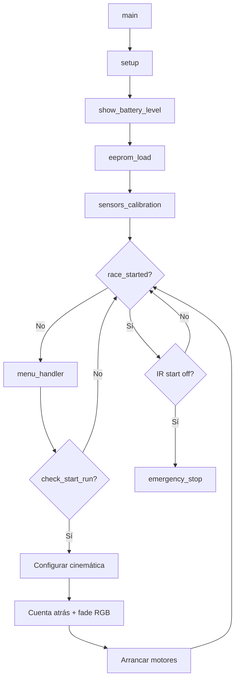
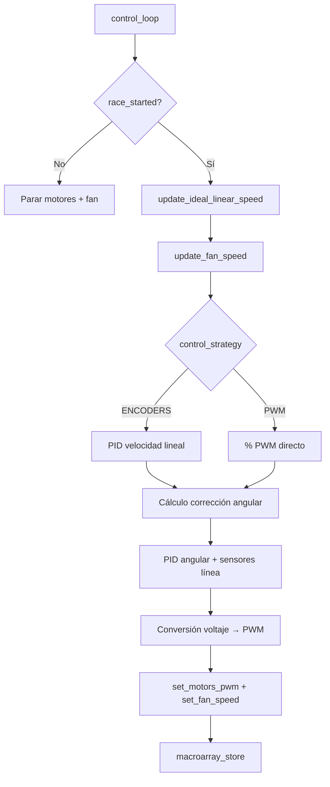
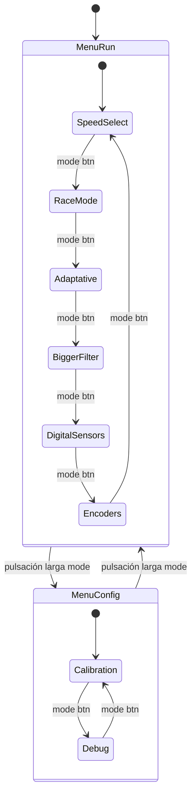

# Arquitectura Software

## Visión general

El firmware de FujitoraBot2 corre sobre STM32F405RGT6 con LibOpenCM3. Sigue un
modelo baremetal con interrupciones jerarquizadas: el SysTick a 1 kHz orquesta
las lecturas de sensores y encoders, mientras que un timer de alta prioridad
(TIM5) ejecuta el lazo de control a 1 kHz.

## Flujo principal

## Mapa de interrupciones

| IRQ | Prioridad | Handler | Función |
|-----|----------|---------|---------|
| **SysTick** | 0 (máx) | `sys_tick_handler` | Clock tick, encoders, ESC init, botones, sensores, giro, batería |
| **DMA2 Stream0** | 1 | `dma2_stream0_isr` | Lectura DMA de ADC1 → actualización multiplexor |
| **TIM2** | 2 | — | Captura encoder derecho |
| **TIM5** | 3 | `tim5_isr` | Lazo de control PID @ 1 kHz |
| **USART3** | 4 | — | Recepción UART (no crítica) |

Las prioridades están definidas en [`setup.c:52-63`](../source_code/src/setup.c#L52-L63).
La prioridad 0 es la más alta en el esquema NVIC de Cortex-M4 (16 grupos).

## SysTick (1 kHz)

El `sys_tick_handler` en [`main.c:19-27`](../source_code/src/main.c#L19-L27) ejecuta
cada milisegundo:

1. `clock_tick()` — incrementa el contador de tiempo del sistema
2. `update_encoder_readings()` — lee encoders en cuadratura y calcula odometría
3. `init_esc()` — secuencia de inicialización de los ESCs (5 s de pulso neutro)
4. `check_buttons()` — lee los botones físicos
5. `sensors_update_line_position()` — calcula la posición de la línea
6. `update_gyro_readings()` — lee el giroscopio y actualiza el ángulo integrado
7. `update_battery_voltage()` — lee y filtra la tensión de batería

## Lazo de control (TIM5, ~1 kHz)

El `tim5_isr` en [`setup.c:247-251`](../source_code/src/setup.c#L247-L251) invoca
`control_loop()` que implementa el control PID en cascada:

(ver [Control PID](05-control-system.md))

## ADC y DMA

El ADC1 lee 3 canales en modo scan continuo con DMA circular (DMA2 Stream0):

- **Canal 10 (PC0)**: multiplexor 8:1, sensores 0–7
- **Canal 11 (PC1)**: multiplexor 8:1, sensores 8–15
- **Canal 12 (PC2)**: multiplexor 8:1, sensores 16–23

Cada vez que el DMA completa una transferencia (3 lecturas), la ISR
`sensors_update_mux_readings()` asigna las lecturas al slot correcto del array
de 24 sensores y avanza el multiplexor.

## Máquina de estados del menú

(ver [Menú](06-menu-system.md))

## Módulos del proyecto

| Módulo | Archivos | Descripción |
|--------|---------|-------------|
| **setup** | `setup.c/h` | Configuración de relojes, GPIO, timers, ADC, SPI, DMA |
| **control** | `control.c/h` | Lazo PID, arranque/parada, gestión de carrera |
| **sensors** | `sensors.c/h` | Lectura y calibración de 24 sensores de línea |
| **motors** | `motors.c/h` | Control PWM de motores y ventilador |
| **encoders** | `encoders.c/h` | Odometría y velocidades |
| **mpu** | `mpu.c/h` | Giroscopio MPU-6500 vía SPI |
| **menu** | `menu.c/h` | Sistema de menú principal |
| **menu_run** | `menu_run.c/h` | Menú de selección de modos de carrera |
| **menu_configs** | `menu_configs.c/h` | Menú de calibración y debug |
| **kinematics** | `kinematics.c/h` | Perfiles de velocidad predefinidos |
| **battery** | `battery.c/h` | Medición de batería |
| **leds** | `leds.c/h` | Control de LEDs (estado, RGB, info) |
| **eeprom** | `eeprom.c/h` | EEPROM emulada en flash |
| **debug** | `debug.c/h` | Sistema de debug y telemetría |
| **macroarray** | `macroarray.c/h` | Buffer de logging para análisis post-carrera |
| **delay** | `delay.c/h` | Utilidades de tiempo (ms, us, DWT) |
| **utils** | `utils.c/h` | `map()` y `constrain()` |
| **buttons** | `buttons.c/h` | Lectura de botones e IR start |
| **usart** | `usart.c/h` | Redirección de `printf` a USART3 |

---

*Documento generado el 2026-06-25. Ver también [Hardware](01-hardware.md), [Control PID](05-control-system.md).*