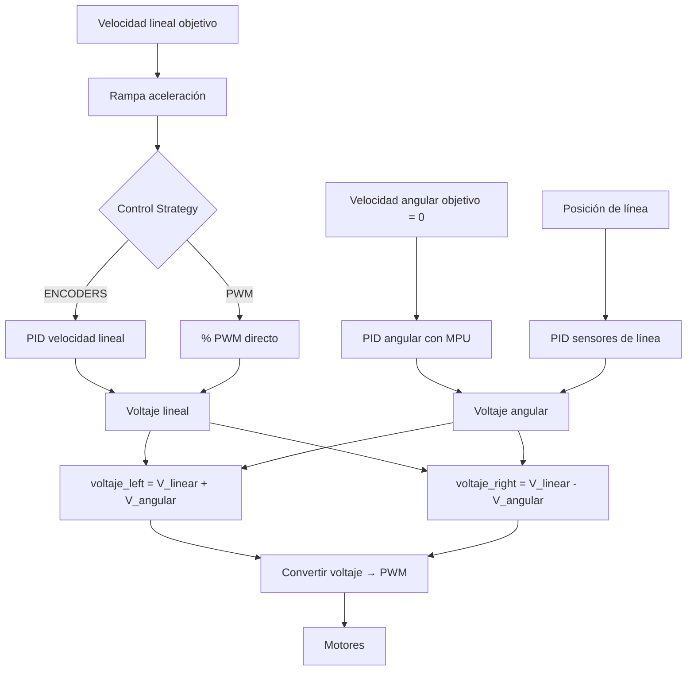

# Control PID

El sistema de control de FujitoraBot2 implementa un PID en cascada que regula
la velocidad lineal y la corrección angular de forma independiente. El lazo
se ejecuta a 1 kHz mediante la interrupción de TIM5.

## Arquitectura del lazo



## Control de velocidad lineal

### Modo Encoder (CONTROL_ENCODERS)

Control proporcional-derivativo sobre el error de velocidad medido por los
encoders:

```
error = Σ(velocidad_ideal − velocidad_medida)
V_linear = KP_LINEAR × error + KD_LINEAR × (error − last_error)
```

| Parámetro | Valor | Descripción |
|-----------|-------|-------------|
| `KP_LINEAR` | 0.00025 | Ganancia proporcional |
| `KD_LINEAR` | 0.0 | Ganancia derivativa (desactivada) |

> **⚠️ Advertencia**: `KD_LINEAR` está a 0.0 en la configuración actual. El
> control de velocidad lineal es puramente integral (I).

**Anti-windup**: si el error acumulado supera 8000 y la velocidad medida es
inferior a 1000 mm/s, el error se satura a 8000 para evitar que la integral
crezca descontroladamente durante la aceleración inicial
([`control.c:254-256`](../source_code/src/control.c#L254-L256)).

### Modo PWM (CONTROL_PWM)

Control en lazo abierto: se aplica un porcentaje fijo de la tensión de batería:

```
V_linear = V_batería_nominal × porcentaje / 100
```

Útil para pruebas y diagnóstico cuando los encoders no están disponibles.

### Rampa de aceleración

La velocidad ideal sigue una rampa lineal hasta alcanzar la velocidad objetivo,
controlada por los parámetros `linear_accel` y `linear_break` del perfil
cinemático activo:

```
si ideal < target: ideal += linear_accel / 1000
si ideal > target: ideal -= linear_break / 1000
```

(ver [Cinemática](12-kinematics.md))

## Corrección angular

La corrección angular combina dos fuentes:

### PID sobre giroscopio (MPU)

Corrige la velocidad angular para mantener trayectoria recta (velocidad angular
objetivo = 0):

```
angular_error = Σ(0 − velocidad_angular_medida)
V_angular_gyro = KP_ANGULAR × angular_error + KD_ANGULAR × Δangular_error
```

| Parámetro | Valor | Descripción |
|-----------|-------|-------------|
| `KP_ANGULAR` | 0.04 | Ganancia proporcional angular |
| `KD_ANGULAR` | 0.3 | Ganancia derivativa angular |

### PID sobre sensores de línea

Corrige la posición lateral respecto a la línea:

```
V_angular_line = KP_LINE_SENSORS × posición + KI_LINE_SENSORS × Σposición + KD_LINE_SENSORS × Δposición
```

| Parámetro | Valor | Descripción |
|-----------|-------|-------------|
| `KP_LINE_SENSORS` | 0.008 | Ganancia proporcional de línea |
| `KI_LINE_SENSORS` | 0.0 | Ganancia integral de línea (desactivada) |
| `KD_LINE_SENSORS` | 0.10 | Ganancia derivativa de línea |

### Activación de correcciones

Las correcciones se activan secuencialmente al iniciar la carrera:

1. **Inicio**: solo corrección por sensores de línea (`line_sensors_correction_enabled = true`)
2. **Corrección MPU**: se activa por separado cuando se requiere (`mpu_correction_enabled = true`)

Ambas pueden habilitarse/deshabilitarse independientemente durante la carrera.

## Conversión voltaje → PWM

```c
pwm = MOTORS_STOP_PWM + (voltaje / V_batería) × (MOTORS_MAX_PWM / 2)
```

La conversión compensa la tensión de batería para mantener la misma velocidad
independientemente del nivel de carga.

| Constante | Valor | Descripción |
|-----------|-------|-------------|
| `MOTORS_STOP_PWM` | 512 | PWM neutro (motor parado) |
| `MOTORS_MAX_PWM` | 1024 | PWM máximo |
| `MOTORS_MIN_PWM` | 522 | PWM mínimo efectivo (evita cogging) |

## Parada de emergencia

La función `emergency_stop()` en [`control.c:347-350`](../source_code/src/control.c#L347-L350):

1. Desactiva `race_started`
2. Registra el timestamp de parada (`emergency_stop_ms`)
3. El lazo de control, al ver `!is_race_started()`, pone PWM neutro en los motores
4. El ventilador se apaga tras 500 ms

Disparadores:
- Señal IR pasa de HIGH a LOW durante la carrera
- Pérdida de línea > `TIEMPO_SIN_PISTA` (150 ms)

## Sistema de arranque

La carrera se inicia mediante:

1. **Señal IR** — flanco ascendente detectado en `check_start_run()`
2. **Botón Mode** — pulsación larga (>1.2 s) como alternativa

Al arrancar:
1. Se configura el perfil cinemático seleccionado en el menú
2. Cuenta atrás configurable (`get_start_millis()`, típicamente 5000 ms)
3. El LED RGB hace un fade de rojo a verde durante la cuenta atrás
4. El ventilador arranca al 75% de la cuenta atrás
5. Al terminar, se activan las correcciones de sensores y los motores

## Telemetría en carrera

Durante la carrera, `control_loop()` almacena en el MacroArray:

| Variable | Descripción |
|----------|-------------|
| `target_linear_speed` | Velocidad objetivo |
| `ideal_linear_speed` | Velocidad ideal (post-rampa) |
| `measured_linear_speed` | Velocidad medida por encoders |
| `line_sensors_error` | Posición de línea (−1000 a +1000) |
| `linear_voltage` | Voltaje lineal aplicado |
| `angular_voltage` | Voltaje angular aplicado |
| `pwm_left/right` | PWM enviado a cada motor |
| `battery_voltage` | Tensión de batería |

(ver [Debug](07-debug-system.md))

---

*Documento generado el 2026-06-25. Ver también [Sensores](03-sensors.md), [Movimiento](04-movement.md), [Cinemática](12-kinematics.md).*
