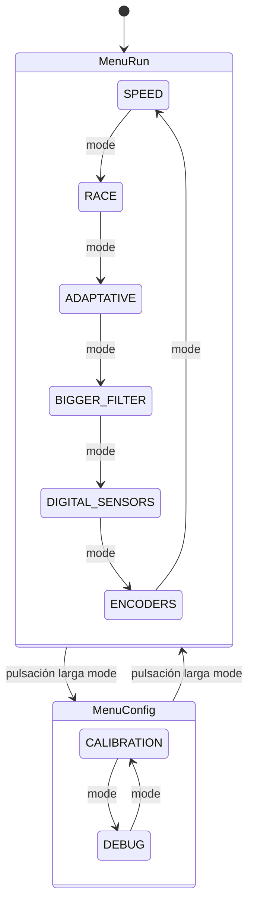

# Menú

FujitoraBot2 implementa un sistema de menú con dos niveles principales y
retroalimentación visual mediante LEDs. La navegación se realiza con tres
botones físicos.

## Botones

| Botón | Pin | Función |
|-------|-----|---------|
| **IR Start** | PB12 | Sensor IR remoto para inicio de carrera |
| **Menu Up** | PB13 | Incrementar valor / opción anterior |
| **Menu Down** | PB14 | Decrementar valor / opción siguiente |
| **Menu Mode** | PB15 | Cambiar modo / pulsación larga para volver |

Los botones se leen en `check_buttons()` llamado desde el SysTick a 1 kHz.

## Estructura del menú

## Menú Run — selección de modo de carrera

El menú principal (por defecto al encender) permite configurar los parámetros
de la carrera. Tiene 6 modos:

| Modo | Variable | Opciones |
|------|----------|----------|
| **Speed** | `valueRun[0]` | TEST, BASE, NORMAL, MEDIUM, FAST, HAKI |
| **Race** | `valueRun[1]` | 0 = Standby, 1 = Preparado |
| **Adaptative** | `valueRun[2]` | 0 = No, 1 = Sí |
| **BiggerFilter** | `valueRun[3]` | 0 = No, 1 = Sí |
| **Digital Sensors** | `valueRun[4]` | 0 = Analógico, 1 = Digital |
| **Encoders** | `valueRun[5]` | 0 = PWM, 1 = Encoders |

Los valores se guardan en EEPROM al activar el modo carrera (`valueRun[1] = 1`).

### Perfiles de velocidad

| Perfil | Índice | Descripción |
|--------|--------|-------------|
| `SPEED_TEST` | 0 | 2000 mm/s — pruebas lentas |
| `SPEED_BASE` | 1 | 2500 mm/s — base de desarrollo |
| `SPEED_NORMAL` | 2 | 3000 mm/s — velocidad normal |
| `SPEED_MEDIUM` | 3 | 3500 mm/s — velocidad media |
| `SPEED_FAST` | 4 | 4000 mm/s — alta velocidad |
| `SPEED_HAKI` | 5 | 4500 mm/s — velocidad máxima |

### Indicadores LED

- **LEDs de info 0–4**: barra de velocidad seleccionada (SPEED_TEST = LED0,
  SPEED_HAKI = todos encendidos parpadeando)
- **LED de info 5**: velocidad adaptativa activa
- **LED de info 6**: BiggerFilter activo
- **LED de info 8**: sensores digitales activos
- **LED de info 9**: control por encoders activo
- **LED RGB**: verde si el modo está activo; morado si Race Mode está armado

## Menú Config — calibración y debug

Accesible con pulsación larga (>200 ms) del botón Mode desde el menú Run.

| Modo | Opciones |
|------|----------|
| **Calibration** | None, Calibrate Gyro Z, Calibrate Sensors, Store EEPROM |
| **Debug** | None, MacroArray, Sensors Raw, Sensors Calibrated, Line Position, Motors, Encoders, Digital IO, Position Correction, LED Party, Fan Demo |

### Indicadores LED

- **LED de estado**: parpadeo rápido = modo Calibración; encendido fijo = modo Debug
- **LED RGB**: verde durante calibración activa

(ver [Calibración](08-calibration.md), [Debug](07-debug-system.md))

---

*Documento generado el 2026-06-25. Ver también [Calibración](08-calibration.md), [Debug](07-debug-system.md).*
