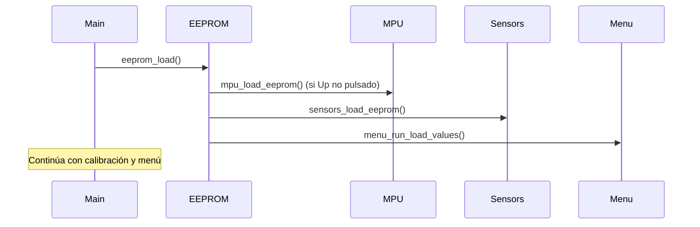

# EEPROM

FujitoraBot2 emula una EEPROM usando el sector 11 de la flash interna del
STM32F405 (último sector de 128 KB). Almacena calibraciones y configuración
de menú de forma persistente entre reinicios.

## Configuración de flash

| Característica | Detalle |
|---------------|---------|
| **Sector** | 11 (último sector de 128 KB) |
| **Dirección base** | `0x080E0000` |
| **Tamaño del sector** | 128 KB |
| **Tamaño de palabra** | 16 bits (`FLASH_CR_PROGRAM_X16`) |
| **Operaciones** | Lectura directa (`MMIO32`), escritura (`flash_program_word`), borrado (`flash_erase_sector`) |

> **⚠️ Advertencia**: El borrado de la flash es por sector completo. Cualquier
> escritura requiere borrar las 128 KB del sector 11, lo que bloquea la CPU
> durante la operación. El guardado solo se realiza cuando hay cambios
> (`is_dirty = true`).

## Layout de datos

El array `eeprom_data[]` tiene `DATA_LENGTH` elementos de 16 bits cada uno:

| Offset | Índice | Tamaño | Contenido |
|--------|--------|--------|-----------|
| `DATA_INDEX_GYRO_Z` | 0 | 1 | Offset Z del giroscopio |
| `DATA_INDEX_SENSORS_MAX` | 1–24 | 24 | Valores máximos de calibración por sensor |
| `DATA_INDEX_SENSORS_MIN` | 25–48 | 24 | Valores mínimos de calibración por sensor |
| `DATA_INDEX_SENSORS_UMB` | 49–72 | 24 | Umbrales de detección por sensor |
| `DATA_INDEX_MENU_RUN` | 73–78 | 6 | Valores del menú de carrera |

Total: 79 palabras de 16 bits = 158 bytes útiles.

## Operaciones

### Carga (`eeprom_load`)

Se ejecuta al inicio de `main()`:

1. Lee todo el sector 11 mediante `MMIO32` palabra a palabra
2. Si el botón Up NO está pulsado: carga el offset del giro y lo aplica al MPU
3. Carga los valores de calibración de sensores
4. Carga los valores del menú de carrera
5. Fuerza `valueRun[MODE_RACE] = 0` para evitar arranque accidental

### Guardado (`eeprom_save`)

1. Verifica que haya cambios pendientes (`is_dirty`)
2. Espera 200 ms con LED de warning
3. Desbloquea la flash
4. Borra el sector 11 completo
5. Escribe las 79 palabras secuencialmente
6. Bloquea la flash

### Marca de suciedad

`eeprom_set_data()` compara los valores nuevos con los existentes. Si algún
valor difiere, activa `is_dirty = true`. Esto evita escrituras innecesarias
que desgastarían la flash.

### Borrado completo

`eeprom_clear()` borra el sector sin reescribir. Útil para resetear a
valores de fábrica.

## Secuencia de inicio

---

*Documento generado el 2026-06-25. Ver también [Calibración](08-calibration.md), [Menú](06-menu-system.md).*
