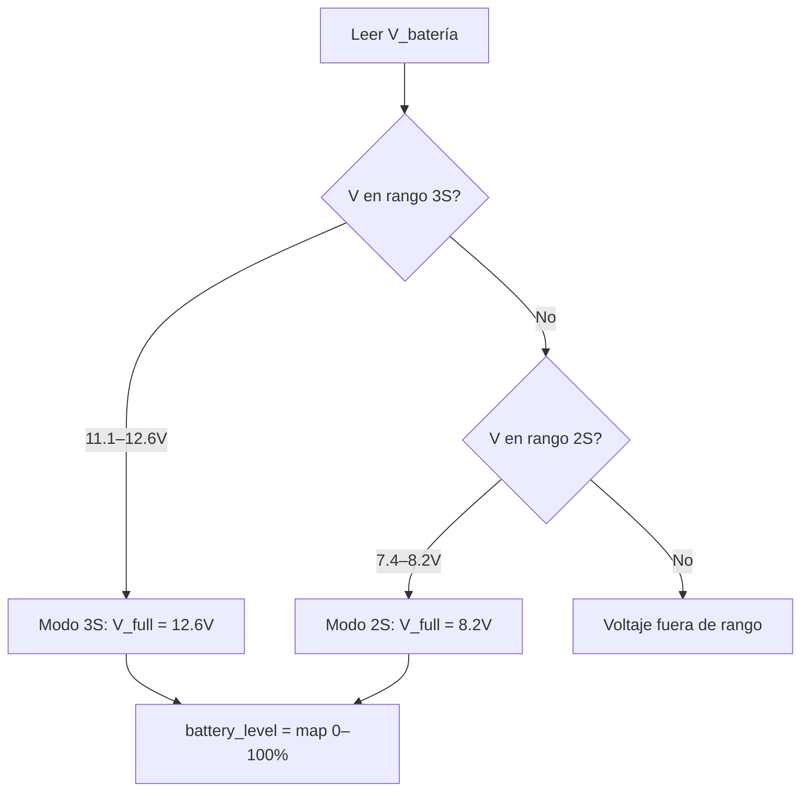

# Batería y LEDs

## Sistema de batería

FujitoraBot2 funciona con baterías LiPo de 2 o 3 celdas (2S/3S) y detecta
automáticamente la configuración conectada.

### Medición de tensión

| Característica | Detalle |
|---------------|---------|
| **ADC** | ADC2, canal 13 (PC3) |
| **Resolución** | 12 bits (0–4095) |
| **LSB** | 3.3 V / 4096 = 0.806 mV |
| **Divisor** | ×3.8673 (`VOLT_DIV_FACTOR`) |
| **Filtro** | Paso bajo α = 0.1 |
| **Frecuencia** | 1 kHz (SysTick) |

### Cálculo

```
V_batería = lectura_ADC × (3.3 / 4096) × 3.8673
V_filtrada = 0.1 × V_actual + 0.9 × V_anterior
```

### Rangos de detección

| Batería | Tensión nominal | Límite bajo | Límite alto |
|---------|----------------|-------------|-------------|
| **2S** | 7.4 V | 7.4 V | 8.2 V |
| **3S** | 11.1 V | 11.1 V | 12.6 V |



La detección se realiza en `show_battery_level()`
([`battery.c:27-42`](../source_code/src/battery.c#L27-L42)).

### Visualización de nivel de batería

Al encender, los LEDs de info muestran una barra de nivel de batería durante
750 ms usando `set_leds_battery_level()`.

### Tensión de referencia para control de motores

`get_battery_full_voltage()` devuelve la tensión nominal de la batería detectada
(8.2 V para 2S, 12.6 V para 3S). Este valor se usa en el cálculo de PWM para
compensar la caída de tensión durante la descarga.

## Sistema de LEDs

FujitoraBot2 tiene tres tipos de LEDs:

| Tipo | Cantidad | Control | Descripción |
|------|----------|---------|-------------|
| **LED de estado** | 1 | GPIO | Indicador de corazón del sistema |
| **LED RGB** | 1 | TIM1 PWM (4 canales) | Información contextual de menú y calibración |
| **LEDs de info** | 10 | GPIO (PA0–PA7, PC4–PC5) | Indicadores de modo y configuración |

### LED de estado

Controlado por GPIO. Modos disponibles:

| Modo | Función | Descripción |
|------|---------|-------------|
| `set_status_led(true/false)` | On/Off | Estado binario |
| `toggle_status_led()` | Toggle | Alterna el estado |
| `warning_status_led(ms)` | Parpadeo | Parpadeo rápido de advertencia |
| `set_status_heartbeat()` | Latido | Señal de vida continua |

### LED RGB

Controlado por TIM1 con 4 canales PWM a 4 kHz (resolución 1024 pasos):

| Canal TIM1 | Pin | Color |
|-----------|-----|-------|
| CH1 | PA8 | Rojo |
| CH2 | PA9 | Verde |
| CH3 | PA10 | Azul |
| CH4 | PA11 | — (reserva) |

Modos disponibles:

| Modo | Descripción |
|------|-------------|
| `set_RGB_color(r,g,b)` | Color fijo (0–255 por canal) |
| `warning_RGB_color(r,g,b,ms)` | Parpadeo de color |
| `set_RGB_rainbow()` | Arcoíris continuo (durante calibración) |

### LEDs de info

| Índice | Pin | Significado en menú Run |
|--------|-----|------------------------|
| 0–4 | PA0–PA4 | Velocidad seleccionada (barra) |
| 5 | PA5 | Velocidad adaptativa activa |
| 6 | PA6 | BiggerFilter activo |
| 7 | PA7 | Reserva |
| 8 | PC4 | Sensores digitales activos |
| 9 | PC5 | Control por encoders activo |

Modos de grupo:

| Modo | Descripción |
|------|-------------|
| `set_info_leds()` | Todos encendidos |
| `clear_info_leds()` | Todos apagados |
| `set_info_leds_wave(ms)` | Onda secuencial |
| `set_info_leds_blink(ms)` | Parpadeo sincronizado |

### Apagado en carrera

Al iniciar la carrera, todos los LEDs se apagan (`set_RGB_color(0,0,0)`,
`set_status_led(false)`, `clear_info_leds()`) para evitar interferencias
con los sensores IR de línea.

---

*Documento generado el 2026-06-25. Ver también [Hardware](01-hardware.md), [Menú](06-menu-system.md).*
