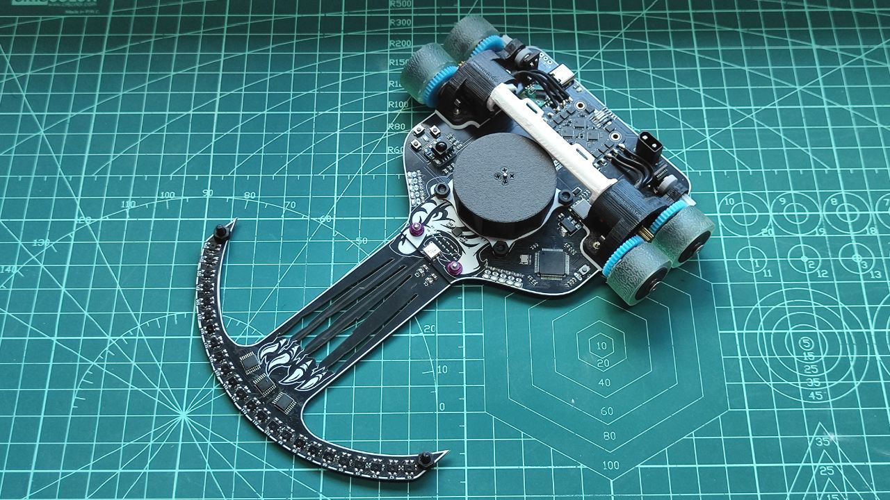

# FujitoraBot2

Versión 2 de FujitoraBot, renovando el hardware después de 5 años: más rápido,
con 24 sensores de línea, giroscopio MPU-6500 y diseño más modular. Robot
micromouse de competición orientado al seguimiento de línea de alta velocidad.

## 🏆 Palmarés

| Competición | Resultado | Fecha |
|------------|-----------|-------|
| — | — | — |

---

## ⚙️ Hardware

| Característica | Detalle |
|---------------|---------|
| **Microcontrolador** | STM32F405RGT6 @ 168 MHz |
| **Sensores** | 24 sensores IR de línea + MPU-6500 (giroscopio 3 ejes) |
| **Motores** | 2× DC con ESC BLHeli (OneShot125) + ventilador |
| **Encoders** | 2× encoders magnéticos en cuadratura |
| **Batería** | LiPo 2S/3S con divisor de tensión y detección automática |
| **Chasis** | Diseño propio en 3D (SketchUp + STL) + PCB KiCad |

---

## 💻 Software

| Componente | Detalle |
|-----------|---------|
| **Framework** | LibOpenCM3 |
| **Frecuencia control** | 1000 Hz (TIM5) |
| **Algoritmo** | PID en cascada: velocidad lineal + corrección angular (giro + sensores) |
| **Debug** | USART3 @ 115200 baud + MacroArray para telemetría |

---

## 📚 Documentación

- [Hardware](01-hardware.md)
- [Arquitectura Software](02-software-architecture.md)
- [Sensores](03-sensors.md)
- [Movimiento](04-movement.md)
- [Control PID](05-control-system.md)
- [Menú](06-menu-system.md)
- [Debug](07-debug-system.md)
- [Calibración](08-calibration.md)
- [EEPROM](09-storage.md)
- [Encoders y Giroscopio](10-encoders-gyro.md)
- [Batería y LEDs](11-battery-leds.md)
- [Cinemática](12-kinematics.md)
- [Problemas Conocidos](13-known-issues.md)

---

## 🔧 Stack Tecnológico

| Componente | Detalle |
|-----------|---------|
| **MCU** | STM32F405RGT6 @ 168 MHz (ARM Cortex-M4F) |
| **Framework** | LibOpenCM3 + PlatformIO |
| **Lenguaje** | C11 |
| **Compilador** | GCC ARM Embedded (arm-none-eabi-gcc) |
| **IDE** | VSCode |

---

## 🎥 Vídeos

<!-- Enlaces a vídeos del robot en acción -->

*Documento generado el 2026-06-25. Ver también [Hardware](01-hardware.md).*
